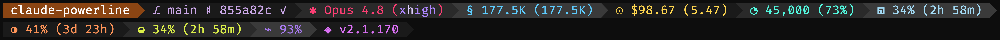
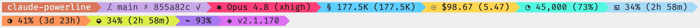
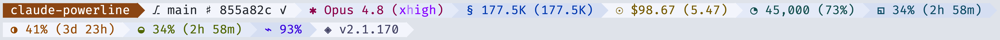
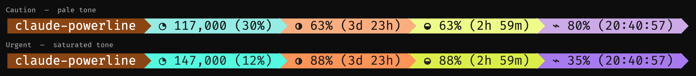

<div align="center">

# Claude Powerline

**A vim-style powerline statusline for Claude Code with real-time usage tracking, git integration, and custom themes.**


[](https://www.npmjs.com/package/@owloops/claude-powerline)
[](https://www.npmjs.com/package/@owloops/claude-powerline)
[](https://packagephobia.com/result?p=@owloops/claude-powerline)
[](https://www.npmjs.com/package/@owloops/claude-powerline)

[](https://github.com/hesreallyhim/awesome-claude-code)


</div>

> [!NOTE]
> **This is a personal fork** — [KawaiiLLM/claude-powerline](https://github.com/KawaiiLLM/claude-powerline), built on top of [Owloops/claude-powerline](https://github.com/Owloops/claude-powerline) v1.23.5. It re-centres the model segment on **live reasoning effort**, adds **5-hour** and **cache-hit** segments, a **two-tier alert escalation**, and a redesigned **dark / light / white** theme trio. See [What this fork adds](#what-this-fork-adds).

## What this fork adds

On top of upstream v1.23.5:

- **Live reasoning effort in the model segment** — shows the current `/effort` level (`low · medium · high · xhigh · max`) with Claude Code's own per-level treatment: flat semantic colours for low/medium/high, a glint sweep for xhigh, and a scrolling rainbow for max.
- **`fiveHour` segment** — 5-hour rate-limit utilisation with reset countdown (native `rate_limits.five_hour`).
- **`cacheHit` segment** — prompt-cache hit rate with TTL countdown.
- **New `session` token modes** — `io` (↑input ↓output) and `tokens-today` (session total + today's slice).
- **Two-tier alert escalation** — `weekly` / `fiveHour` / `context` / `cacheHit` step through the segment's **pale** tone (caution) then its **saturated** tone (urgent): the hue stays constant, so a chip tells you *which* limit and *how close*.

  | Segment | Caution (pale) | Urgent (saturated) |
  | --- | --- | --- |
  | `weekly` | ≥ 50% | ≥ 80% |
  | `fiveHour` | ≥ 50% | ≥ 80% |
  | `context` | ≤ 40% left or ≥ 300k | ≤ 20% left or ≥ 500k |
  | `cacheHit` | < 90% | < 50% |

- **Redesigned themes** — `dark` and `light` are now an fg↔bg inversion pair built from one 13-colour "rainbow-streak" palette, plus a new near-white `white` theme. Chip backgrounds cycle by position so neighbours stay distinct.
- **Pricing** — adds Opus 4.8 and Fable 5, and fixes the generic `opus` fallback to the current tier.

### Theme preview

Live render of the same statusline across the three reworked themes (segments wrap to a second line):

<br>
<br>


And the two-tier alert escalation — the same segments at their caution vs. urgent thresholds (dark theme). Each hue holds; only the fill goes from pale to saturated:



## Installation

Requires Node.js 18+, Claude Code, and Git 2.0+. For best display, install a [Nerd Font](https://www.nerdfonts.com/) or use `--charset=text` for ASCII-only symbols.

### Setup Wizard (Recommended)

The interactive wizard walks you through theme, style, font, segment, and budget selection.

```bash
# run inside Claude Code, one at a time
/plugin marketplace add Owloops/claude-powerline
/plugin install claude-powerline@claude-powerline
/powerline
```

The wizard writes `~/.claude/claude-powerline.json` and updates your `settings.json` automatically. Run `/powerline` again any time to reconfigure.

### Manual Setup

Add to your Claude Code `settings.json`:

```json
{
  "statusLine": {
    "type": "command",
    "command": "npx -y @owloops/claude-powerline@latest --style=powerline"
  }
}
```

Start a Claude session and the statusline appears at the bottom. Using `npx` automatically downloads and runs the latest version without manual updates.

> [!IMPORTANT]
> The commands above install **upstream** from npm. This fork is not published to npm — to run *this* version, clone and build it, then point your statusline at the local build:
>
> ```bash
> git clone https://github.com/KawaiiLLM/claude-powerline.git
> cd claude-powerline && npm install && npm run build
> ```
>
> ```json
> {
>   "statusLine": {
>     "type": "command",
>     "command": "node /absolute/path/to/claude-powerline/dist/index.mjs --style=powerline --theme=dark"
>   }
> }
> ```

## Styles


## Themes


7 built-in themes (dark, light, white, nord, tokyo-night, rose-pine, gruvbox) or [create your own](#configuration). In this fork, `dark` / `light` are a reworked rainbow-streak inversion pair and `white` is new — see the [theme preview](#theme-preview) above.

<details>
<summary><h2>Configuration</h2></summary>

**Config locations** (in priority order):

- `./.claude-powerline.json` - Project-specific
- `~/.claude/claude-powerline.json` - User config
- `~/.config/claude-powerline/config.json` - XDG standard

**Override priority:** CLI flags > Environment variables > Config files > Defaults

Config files reload automatically, no restart needed.

**Get example config:**

```bash
curl -o ~/.claude/claude-powerline.json https://raw.githubusercontent.com/Owloops/claude-powerline/main/.claude-powerline.json
```

<details>
<summary><strong>CLI Options and Environment Variables</strong></summary>

**CLI Options** (both `--arg value` and `--arg=value` syntax supported):

- `--theme` - `dark` (default), `light`, `white`, `nord`, `tokyo-night`, `rose-pine`, `gruvbox`, `custom`
- `--style` - `minimal` (default), `powerline`, `capsule`, `tui`
- `--charset` - `unicode` (default), `text`
- `--config` - Custom config file path
- `--help` - Show help

**Examples:**

```bash
claude-powerline --theme=nord --style=powerline
claude-powerline --theme=dark --style=capsule --charset=text
claude-powerline --config=/path/to/config.json
```

**Environment Variables:**

```bash
export CLAUDE_POWERLINE_THEME=dark
export CLAUDE_POWERLINE_STYLE=powerline
export CLAUDE_POWERLINE_CONFIG=/path/to/config.json
export CLAUDE_POWERLINE_DEBUG=1  # Enable debug logging
```

</details>

### Segment Configuration

<details>
<summary><strong>Directory</strong> - Shows current working directory name</summary>

```json
"directory": {
  "enabled": true,
  "style": "full"
}
```

**Options:**

- `style`: Display format - `full` | `fish` | `basename`
  - `full`: Show complete path (e.g., `~/projects/claude-powerline`)
  - `fish`: Fish-shell style abbreviation (e.g., `~/p/claude-powerline`)
  - `basename`: Show only folder name (e.g., `claude-powerline`)

</details>

<details>
<summary><strong>Git</strong> - Shows branch, status, and repository information</summary>

```json
"git": {
  "enabled": true,
  "showSha": true,
  "showWorkingTree": false,
  "showOperation": false,
  "showTag": false,
  "showTimeSinceCommit": false,
  "showStashCount": false,
  "showUpstream": false,
  "showRepoName": false
}
```

**Options:**

- `showSha`: Show abbreviated commit SHA
- `showWorkingTree`: Show staged/unstaged/untracked counts
- `showOperation`: Show ongoing operations (MERGE/REBASE/CHERRY-PICK)
- `showTag`: Show nearest tag
- `showTimeSinceCommit`: Show time since last commit
- `showStashCount`: Show stash count
- `showUpstream`: Show upstream branch
- `showRepoName`: Show repository name

**Symbols:**

- Unicode: `⎇` Branch &#8226; `♯` SHA &#8226; `⌂` Tag &#8226; `⧇` Stash &#8226; `✓` Clean &#8226; `●` Dirty &#8226; `⚠` Conflicts &#8226; `↑3` Ahead &#8226; `↓2` Behind &#8226; `(+1 ~2 ?3)` Staged/Unstaged/Untracked
- Text: `~` Branch &#8226; `#` SHA &#8226; `T` Tag &#8226; `S` Stash &#8226; `=` Clean &#8226; `*` Dirty &#8226; `!` Conflicts &#8226; `^3` Ahead &#8226; `v2` Behind &#8226; `(+1 ~2 ?3)` Staged/Unstaged/Untracked

</details>

<details>
<summary><strong>Model</strong> - Shows current Claude model and live reasoning effort</summary>

```json
"model": {
  "enabled": true
}
```

Displays the model name followed by the current reasoning-effort level in parentheses, e.g. `✱ Opus 4.8 (high)`. The effort label is read live from Claude Code's statusline payload and is tinted with that level's treatment — `low`/`medium`/`high` use a flat semantic colour, `xhigh` runs a glint sweep, and `max` scrolls a rainbow. The colours adapt to the chip background so the label stays legible across themes.

**Symbols:** `✱` Model (unicode) &#8226; `M` Model (text)

</details>

<details>
<summary><strong>Session</strong> - Shows real-time usage for current Claude conversation</summary>

```json
"session": {
  "enabled": true,
  "type": "tokens",
  "costSource": "calculated"
}
```

**Options:**

- `type`: Display format - `cost` | `tokens` | `both` | `breakdown` | `io` | `tokens-today`
  - `io`: Input/output split for the session (e.g. `↑12.4K ↓3.1K`)
  - `tokens-today`: Session total plus this session's tokens since local midnight (e.g. `177.5K (177.5K)`)
- `costSource`: Cost calculation method - `calculated` (ccusage-style) | `official` (hook data)

**Symbols:** `§` Session (unicode) &#8226; `S` Session (text)

</details>

<details>
<summary><strong>Today</strong> - Shows total daily usage with budget monitoring</summary>

```json
"today": {
  "enabled": true,
  "type": "cost"
}
```

**Options:**

- `type`: Display format - `cost` | `tokens` | `both` | `breakdown`

**Symbols:** `☉` Today (unicode) &#8226; `D` Today (text)

</details>

<details>
<summary><strong>Context</strong> - Shows context window usage and auto-compact threshold</summary>

```json
"context": {
  "enabled": true,
  "showPercentageOnly": false,
  "displayStyle": "text",
  "autocompactBuffer": 33000
}
```

**Options:**

- `showPercentageOnly`: Show only percentage remaining (default: false)
- `displayStyle`: Visual style for context display (default: `"text"`)
- `autocompactBuffer`: Number of tokens reserved as the auto-compact trigger zone (default: `33000`). The usable percentage reflects how close you are to the point where compaction fires. Set to `0` if you have auto-compact disabled to show raw context usage instead
- `percentageMode`: How to display the percentage. `"remaining"` counts down from 100% (context left), `"used"` counts up from 0% (context consumed). Default depends on display style: `"remaining"` for `text`, `"used"` for bar styles

**Display Styles:**

| Style | Filled | Empty | Example |
|-------|--------|-------|---------|
| `text` | -- | -- | `◔ 34,040 (79%)` |
| `ball` | ─ | ─ | `─────●──── 50%` |
| `bar` | ▓ | ░ | `▓▓▓▓▓░░░░░ 50%` |
| `blocks` | █ | ░ | `█████░░░░░ 50%` |
| `blocks-line` | █ | ─ | `█████───── 50%` |
| `capped` | ━ | ┄ | `━━━━╸┄┄┄┄┄ 50%` |
| `dots` | ● | ○ | `●●●●●○○○○○ 50%` |
| `filled` | ■ | □ | `■■■■■□□□□□ 50%` |
| `geometric` | ▰ | ▱ | `▰▰▰▰▰▱▱▱▱▱ 50%` |
| `line` | ━ | ┄ | `━━━━━┄┄┄┄┄ 50%` |
| `squares` | ◼ | ◻ | `◼◼◼◼◼◻◻◻◻◻ 50%` |

**Symbols:** `◔` Context (unicode) &#8226; `C` Context (text)

#### Model Context Limits

Configure context window limits for different model types. Defaults to 200K tokens for all models.

```json
"modelContextLimits": {
  "sonnet": 1000000,
  "opus": 200000
}
```

**Available Model Types:**

- `sonnet`: Claude Sonnet models (3.5, 4, etc.)
- `opus`: Claude Opus models
- `default`: Fallback for unrecognized models (200K)

**Note:** Sonnet 4's 1M context window is currently in beta for tier 4+ users. Set `"sonnet": 1000000` when you have access.

</details>

<details>
<summary><strong>Block</strong> - Shows usage within current 5-hour billing window (Claude's rate limit period)</summary>

```json
"block": {
  "enabled": true,
  "type": "weighted",
  "burnType": "cost",
  "displayStyle": "text"
}
```

**Options:**

- `type`: Display format - `cost` | `tokens` | `both` | `time` | `weighted`
- `burnType`: Burn rate display - `cost` | `tokens` | `both` | `none`
- `displayStyle`: Visual style for utilization display (see table below). Only applies when native rate limit data is available.

**Native Rate Limits:** When Claude Code provides `rate_limits` in its hook data (Claude.ai Pro/Max subscribers), the block segment displays the official 5-hour utilization percentage and reset countdown instead of transcript-based estimates. This is more accurate, accounts for cross-machine usage, and requires no disk I/O. When native data is unavailable (API users, older Claude Code versions), the segment falls back to transcript-based cost/token tracking.

**Display Styles** (native mode only):

| Style | Example |
|-------|---------|
| `text` (default) | `◱ 23% (4h 12m)` |
| `bar` | `◱ ▪▪▫▫▫▫▫▫▫▫ 23% (4h 12m)` |
| `blocks` | `◱ ██░░░░░░░░ 23% (4h 12m)` |
| `blocks-line` | `◱ ██──────── 23% (4h 12m)` |
| `capped` | `◱ ━╸┄┄┄┄┄┄┄┄ 23% (4h 12m)` |
| `dots` | `◱ ●●○○○○○○○○ 23% (4h 12m)` |
| `filled` | `◱ ■■□□□□□□□□ 23% (4h 12m)` |
| `geometric` | `◱ ▰▰▱▱▱▱▱▱▱▱ 23% (4h 12m)` |
| `line` | `◱ ━━┄┄┄┄┄┄┄┄ 23% (4h 12m)` |
| `squares` | `◱ ◼◼◻◻◻◻◻◻◻◻ 23% (4h 12m)` |
| `ball` | `◱ ──●─────── 23% (4h 12m)` |

**Weighted Tokens:** In transcript mode, Opus tokens count 5x toward rate limits compared to Sonnet/Haiku tokens

**Symbols:** `◱` Block (unicode) &#8226; `B` Block (text)

</details>

<details>
<summary><strong>Weekly</strong> - Shows usage within 7-day rolling rate limit window</summary>

```json
"weekly": {
  "enabled": true,
  "displayStyle": "text"
}
```

**Options:**

- `displayStyle`: Visual style for utilization display - same options as the block segment (see table above)

Only visible when Claude Code provides native `rate_limits.seven_day` data (Claude.ai Pro/Max subscribers). Hidden when the data is not available.

When utilisation crosses a threshold the chip escalates: a **pale** fill at ≥ 50% (caution) and the segment's **saturated** fill at ≥ 80% (urgent).

**Symbols:** `◑` Weekly (unicode) &#8226; `W` Weekly (text)

</details>

<details>
<summary><strong>FiveHour</strong> - Shows usage within the current 5-hour rate limit window</summary>

```json
"fiveHour": {
  "enabled": true,
  "displayStyle": "text"
}
```

**Options:**

- `displayStyle`: Visual style for utilisation display - same options as the block segment

Shows the official 5-hour utilisation percentage and reset countdown. Like `weekly`, the chip escalates through a **pale** fill at ≥ 50% and a **saturated** fill at ≥ 80%. Only visible when Claude Code provides native `rate_limits.five_hour` data (Claude.ai Pro/Max subscribers).

**Symbols:** `◒` FiveHour (unicode) &#8226; `5h` FiveHour (text)

</details>

<details>
<summary><strong>CacheHit</strong> - Shows prompt-cache hit rate for the session</summary>

```json
"cacheHit": {
  "enabled": true
}
```

Shows the weighted prompt-cache hit rate (cache reads vs. total input) with the active cache's TTL countdown, e.g. `⌁ 93% (20:02:46)`. Because a healthy session normally sits well above 90%, the chip escalates as the rate **falls**: a **pale** fill below 90% (caution) and a **saturated** fill below 50% (urgent).

**Symbols:** `⌁` CacheHit (unicode) &#8226; `C` CacheHit (text)

</details>

<details>
<summary><strong>Metrics</strong> - Shows performance analytics from your Claude sessions</summary>

```json
"metrics": {
  "enabled": true,
  "showResponseTime": true,
  "showLastResponseTime": false,
  "showDuration": true,
  "showMessageCount": true,
  "showLinesAdded": true,
  "showLinesRemoved": true
}
```

**Options:**

- `showResponseTime`: Total API duration across all requests
- `showLastResponseTime`: Individual response time for most recent query
- `showDuration`: Total session duration
- `showMessageCount`: Number of user messages sent
- `showLinesAdded`: Lines of code added during session
- `showLinesRemoved`: Lines of code removed during session

**Symbols:**

- Unicode: `⧖` Total API time &#8226; `Δ` Last response &#8226; `⧗` Session duration &#8226; `⟐` Messages &#8226; `+` Lines added &#8226; `-` Lines removed
- Text: `R` Total API time &#8226; `L` Last response &#8226; `T` Session duration &#8226; `#` Messages &#8226; `+` Lines added &#8226; `-` Lines removed

</details>

<details>
<summary><strong>Version</strong> - Shows Claude Code version</summary>

```json
"version": {
  "enabled": true
}
```

**Display:** `v1.0.81`

**Symbols:** `◈` Version (unicode) &#8226; `V` Version (text)

</details>

<details>
<summary><strong>Tmux</strong> - Shows tmux session name and window info when in tmux</summary>

```json
"tmux": {
  "enabled": true
}
```

**Display:** `tmux:session-name`

</details>

<details>
<summary><strong>Session ID</strong> - Shows the current Claude session identifier</summary>

```json
"sessionId": {
  "enabled": false,
  "showIdLabel": true
}
```

**Options:**

- `showIdLabel`: Show the `⌗` icon prefix before the session ID (default: `true`)

**Display:** `⌗ a1b2c3d4-...`

**Symbols:** `⌗` Session ID (unicode) &#8226; `#` Session ID (text)

</details>

<details>
<summary><strong>Env</strong> - Shows the value of an environment variable</summary>

```json
"env": {
  "enabled": true,
  "variable": "CLAUDE_ACCOUNT",
  "prefix": "Acct"
}
```

**Options:**

- `variable` (required): Environment variable name to read
- `prefix`: Label shown before the value. Defaults to the variable name

Hidden when the variable is unset or empty.

**Symbols:** `⚙` Env (unicode) &#8226; `$` Env (text)

</details>

### Advanced Configuration

<details>
<summary><strong>Budget Configuration</strong></summary>

```json
"budget": {
  "session": { "amount": 10.0, "warningThreshold": 80 },
  "today": { "amount": 25.0, "warningThreshold": 80 },
  "block": { "amount": 15.0, "type": "cost", "warningThreshold": 80 }
}
```

**Options:**

- `amount`: Budget limit (required for percentage display)
- `type`: Budget type - `cost` (USD) | `tokens` (for token-based limits)
- `warningThreshold`: Warning threshold percentage (default: 80)

**Indicators:** `25%` Normal &#8226; `+75%` Moderate (50-79%) &#8226; `!85%` Warning (80%+)

> [!TIP]
> Claude's rate limits consider multiple factors beyond tokens (message count, length, attachments, model). See [Anthropic's usage documentation](https://support.anthropic.com/en/articles/11014257-about-claude-s-max-plan-usage) for details.

</details>

<details>
<summary><strong>Character Sets</strong></summary>

Choose between Unicode symbols (requires Nerd Font) or ASCII text mode for maximum compatibility.

```json
{
  "display": {
    "charset": "unicode"
  }
}
```

**Options:**

- `unicode` (default) - Uses Nerd Font icons and symbols
- `text` - ASCII-only characters for terminals without Nerd Font

The charset setting works independently from separator styles, giving you 8 possible combinations:

- `minimal` + `unicode` / `text` - No separators
- `powerline` + `unicode` / `text` - Arrow separators (requires Nerd Font for unicode)
- `capsule` + `unicode` / `text` - Rounded caps (requires Nerd Font for unicode)
- `tui` + `unicode` / `text` - Bordered panel with rounded or ASCII box characters

</details>

<details>
<summary><strong>Layout: Auto-Wrap, Multi-line, and Padding</strong></summary>

**Auto-Wrap** (enabled by default):

```json
{
  "display": {
    "autoWrap": true
  }
}
```

Segments flow naturally and wrap to new lines when they exceed the terminal width.

**Multi-line Layout** for manual control:

```json
{
  "display": {
    "lines": [
      {
        "segments": {
          "directory": { "enabled": true },
          "git": { "enabled": true },
          "model": { "enabled": true }
        }
      },
      {
        "segments": {
          "session": { "enabled": true },
          "today": { "enabled": true },
          "context": { "enabled": true }
        }
      }
    ]
  }
}
```

**Padding** - number of spaces on each side of segment text:

```json
{
  "display": {
    "padding": 1
  }
}
```

Set to `0` for compact, `1` (default) for standard spacing.

> [!NOTE]
> Claude Code system messages may truncate long status lines. Use `autoWrap` or manual multi-line layouts to prevent segment cutoff.

</details>

<details>
<summary><strong>Colors and Custom Themes</strong></summary>

Create custom themes and configure color compatibility:

```json
{
  "theme": "custom",
  "display": {
    "colorCompatibility": "auto"
  },
  "colors": {
    "custom": {
      "directory": { "bg": "#ff6600", "fg": "#ffffff" },
      "git": { "bg": "#0066cc", "fg": "#ffffff" },
      "session": { "bg": "#cc0099", "fg": "#ffffff" }
    }
  }
}
```

**Color Options:** `bg` (hex, `transparent`, `none`) &#8226; `fg` (hex)

**Compatibility Modes:** `auto` (default), `ansi`, `ansi256`, `truecolor`

**Environment Variables:**

- `NO_COLOR` - Disable all colors when set to any non-empty value (follows [NO_COLOR standard](https://no-color.org/))
- `FORCE_COLOR` - Force enable color output (follows [FORCE_COLOR standard](https://force-color.org/)):
  - `0` or `false` - Disable colors
  - `1` or `true` - Force basic 16 colors (ANSI)
  - `2` - Force 256 colors
  - `3` - Force truecolor (16 million colors)
  - Any other non-empty value - Force basic colors
- `COLORTERM` - Auto-detected for truecolor support

**Priority:** `FORCE_COLOR` overrides `NO_COLOR` (allowing color to be forced on even when NO_COLOR is set)

</details>

<details>
<summary><strong>TUI Panel Mode</strong></summary>

```json
{
  "statusLine": {
    "type": "command",
    "command": "npx -y @owloops/claude-powerline@latest --style=tui"
  }
}
```

The panel adapts to terminal width across three breakpoints:

- **Wide** (80+ cols): metrics on one line, workspace and footer spread across columns
- **Medium** (55-79 cols): metrics split across two lines, stacked footer
- **Narrow** (<55 cols): fully stacked layout

> [!NOTE]
> Claude Code's internal progress indicators (spinner, context bar) may briefly overlap the TUI panel during tool calls. This is a limitation of the hook architecture and resolves once the tool call completes.

</details>

<details>
<summary><strong>Performance</strong></summary>

Execution times for different configurations:

- **~80ms** default config (`directory`, `git`, `model`, `session`, `today`, `context`)
- **~240ms** full-featured (all segments enabled)

| Segment     | Timing | Notes                                      |
| ----------- | ------ | ------------------------------------------ |
| `directory` | ~40ms  | No external commands                       |
| `model`     | ~40ms  | Uses hook data                             |
| `session`   | ~40ms  | Minimal transcript parsing                 |
| `context`   | ~40ms  | Hook data calculation                      |
| `metrics`   | ~40ms  | Transcript analysis                        |
| `git`       | ~60ms  | No caching for fresh data                  |
| `tmux`      | ~50ms  | Environment check + command                |
| `block`     | ~180ms | 5-hour window transcript load              |
| `today`     | ~250ms | Full daily transcript load (cached: ~50ms) |
| `version`   | ~40ms  | Uses hook data                             |

**Benchmark:** `npm run benchmark:timing`

**Optimization Tips:**

- **Global install:** `npm install -g` to avoid npx overhead
- **Disable unused segments** for faster execution
- **Cache cleanup:** Remove `~/.claude/powerline/` if needed

</details>

<details>
<summary><strong>Custom Segments (Shell Composition)</strong></summary>

Extend the statusline using shell composition:

```json
{
  "statusLine": {
    "type": "command",
    "command": "npx -y @owloops/claude-powerline && echo \" $(date +%H:%M)\"",
    "padding": 0
  }
}
```

> [!NOTE]
> Use `tput` for colors: `setab <bg>` (background), `setaf <fg>` (foreground), `sgr0` (reset). Example: `echo "$(tput setab 4)$(tput setaf 15) text $(tput sgr0)"`. For complex logic, create a shell script with multiple commands, conditions, and variables.

</details>

</details>

## Contributing

Contributions are welcome! Please feel free to submit issues or pull requests.

See [CONTRIBUTORS.md](CONTRIBUTORS.md) for people who have contributed outside of GitHub PRs.

## License

This project is licensed under the [MIT License](LICENSE).
